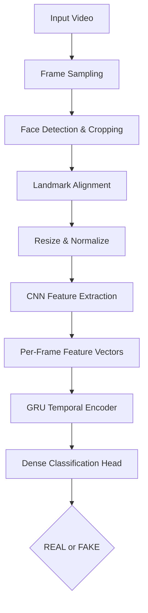

# DeepGuard — CNN-GRU DeepFake Video Detector

> Frame-level CNN feature extraction combined with GRU-based temporal modeling to classify video content as authentic or manipulated.


**~85% test accuracy** on the DFDC sample set · **7-stage** face-aware pipeline · **5** interchangeable model backbones

---

## Table of Contents

- [Overview](#overview)
- [Features](#features)
- [Problem Statement](#problem-statement)
- [Solution Overview](#solution-overview)
- [Architecture](#architecture)
- [Workflow](#workflow)
- [Model Details](#model-details)
- [Tech Stack](#tech-stack)
- [Project Structure](#project-structure)
- [Installation](#installation)
- [Usage](#usage)
- [Results](#results)
- [Screenshots](#screenshots)
- [Future Improvements](#future-improvements)
- [Challenges](#challenges)
- [Learning Outcomes](#learning-outcomes)
- [License](#license)
- [References](#references)

---

## Overview

Synthetic media generated by Generative Adversarial Networks (GANs) has crossed a threshold: manipulated ("deepfake") videos are now frequently indistinguishable from genuine footage to the naked eye. **DeepGuard** closes that gap with an automated pipeline that ingests a video, isolates facial regions across sampled frames, and runs a hybrid CNN + GRU model to determine whether the content is **REAL** or **FAKE** — combining spatial artifact detection with temporal consistency analysis in a single pass.

The system is built for:

- **Researchers** benchmarking deepfake-detection approaches against a reproducible baseline
- **Platform trust & safety teams** exploring automated, pre-publication content moderation
- **Developers** who want a production-shaped reference for video-based binary classification with temporal modeling
- **Students** studying the intersection of computer vision and sequence modeling

It is applicable anywhere video authenticity matters — social media moderation, journalism verification, digital forensics, and identity-fraud prevention.

---

## Features

| Feature | Description |
|---|---|
| Video Ingestion | Accepts raw video files and samples frames at a configurable rate |
| Face Localization | Detects and crops facial regions from each sampled frame |
| Landmark Analysis | Tracks facial landmarks across frames to surface geometric inconsistencies |
| CNN Feature Extraction | Converts each cropped face into a dense feature vector using a pretrained backbone |
| Temporal Sequence Modeling | Feeds per-frame feature vectors into a GRU to capture inter-frame inconsistencies |
| Binary Classification | Outputs a REAL or FAKE label with an associated confidence score |
| Model Comparison | Ships with multiple interchangeable CNN backbones for experimentation |

---

## Problem Statement

Manipulated video content is increasingly used to spread misinformation, impersonate public figures, and commit identity fraud. Because deepfake generation techniques improve continuously, detection systems that rely on visible artifacts alone quickly fall out of date. The core challenges are:

- **Media integrity** — verifying that video content has not been synthetically altered before it is trusted or redistributed
- **Misinformation at scale** — fabricated videos of public figures can spread faster than they can be fact-checked
- **Identity fraud** — face-swap techniques can be used to bypass video-based identity verification
- **Cybersecurity exposure** — synthetic media can be weaponized in social-engineering and disinformation campaigns

A robust, automated detector reduces reliance on manual review and can act as a first line of defense before content spreads.

## Solution Overview

Rather than classifying a video from a single static frame, this project treats deepfake detection as a **sequence problem**. Convolutional backbones extract spatial artifacts within individual frames (blending boundaries, texture inconsistencies, lighting mismatches), while a GRU layer models how those artifacts evolve — or fail to evolve naturally — across time. Frame-level inconsistency alone is often insufficient; genuine temporal coherence is one of the harder properties for generative models to reproduce, which is what the GRU stage is designed to exploit.


---

## Architecture



---

## Workflow

1. **Load video** — accept an uploaded or referenced video file
2. **Sample frames** — extract frames at a fixed interval across the video duration
3. **Detect faces** — locate facial bounding boxes in each sampled frame
4. **Align landmarks** — identify key facial landmarks to normalize pose
5. **Crop & resize** — standardize face crops to the input size expected by the CNN
6. **Normalize pixels** — scale pixel values to match the CNN backbone's expected input distribution
7. **Extract CNN features** — pass each face crop through the pretrained CNN to obtain a feature vector
8. **Sequence with GRU** — feed the ordered sequence of feature vectors into the GRU layer
9. **Classify** — produce a REAL/FAKE prediction with a confidence score
10. **Aggregate & report** — combine frame-level signals into a single video-level verdict

<p align="center">
  
</p>

---

## Model Details

### MesoNet (CNN, frame-level)
**Purpose:** Lightweight CNN originally designed for still-image deepfake detection.
**Advantages:** Small parameter count, fast inference, low compute requirements.
**Limitations:** Evaluates frames independently, so it cannot capture temporal inconsistencies; accuracy drops noticeably on video-derived frames compared to curated still images.

### ResNet50 (CNN, transfer learning)
**Purpose:** Deep residual CNN fine-tuned on face crops extracted from video frames, initialized with ImageNet weights.
**Advantages:** Strong general-purpose feature extractor; residual connections mitigate vanishing-gradient issues during fine-tuning.
**Limitations:** Higher computational cost than lightweight backbones; still frame-independent, so it misses temporal cues on its own.

### EfficientNetB0 (CNN, transfer learning)
**Purpose:** Compound-scaled CNN fine-tuned on the same face-crop dataset, also initialized with ImageNet weights.
**Advantages:** Favorable accuracy-to-parameter ratio compared to ResNet50; efficient for deployment on constrained hardware.
**Limitations:** Like the other standalone CNNs, offers no temporal awareness when used without a sequential head.

### InceptionV3 + GRU (Hybrid, CNN + Sequential)
**Purpose:** Uses InceptionV3 as a per-frame feature extractor, then models the resulting sequence with a GRU to capture temporal inconsistency.
**Advantages:** Meaningful accuracy improvement over frame-independent models by leveraging inter-frame relationships; benefits from Adam's adaptive learning rate during training.
**Limitations:** Degrades when multiple faces appear in a single frame, since the pipeline is designed to track one primary face per sequence.

### EfficientNetB2 + GRU (Hybrid, CNN + Sequential)
**Purpose:** Replaces the InceptionV3 backbone with EfficientNetB2 for feature extraction, retaining the same GRU sequence head.
**Advantages:** Best-performing configuration in this project; accuracy continues to improve with additional training epochs.
**Limitations:** Face-detection reliability drops in low-light or poorly lit video segments, which reduces the quality of upstream feature extraction.

**Shared training configuration:** Adam optimizer, accuracy as the tracked metric, and sparse categorical cross-entropy as the loss function (appropriate for two or more label classes).

---

## Tech Stack

| Category | Technology |
|---|---|
| Language | Python |
| Deep Learning Framework | TensorFlow / Keras |
| Computer Vision | OpenCV |
| Data Handling | Pandas |
| Machine Learning Utilities | scikit-learn |
| Visualization | Seaborn |
| Frontend (deploy) | HTML, CSS |

---

## Project Structure

```
deepfake-detection/
├── data/
│   ├── raw/                  # Source video datasets
│   └── processed/            # Extracted & aligned face frames
├── notebooks/                # Experimentation notebooks
├── src/
│   ├── preprocessing/        # Frame extraction, face detection, alignment
│   ├── models/                # CNN backbones and GRU sequence model definitions
│   ├── training/              # Training and evaluation scripts
│   └── inference/             # Prediction pipeline
├── deploy/
│   └── main.py                # Entry point for running predictions
├── requirements.txt
└── README.md
```

---

## Installation

```bash
# Clone the repository
git clone https://github.com/<your-username>/deepfake-detection.git
cd deepfake-detection

# (Recommended) create a virtual environment
python -m venv venv
source venv/bin/activate      # Windows: venv\Scripts\activate

# Install dependencies
pip install -r requirements.txt
```

> A CUDA-capable GPU is strongly recommended for both training and inference.

---

## Usage

```bash
# Run inference on a video
python deploy/main.py --input path/to/video.mp4
```

A 10-second, 30fps clip typically returns a prediction within about a minute on GPU hardware. Ensure all dependencies from `requirements.txt` are installed before running.

---

## Results


| Model | Accuracy | Notes |
|---|---|---|
| MesoNet | Low on video frames | Designed for still images; not video-optimized |
| ResNet50 (CNN only) | Moderate | Frame-independent, no temporal signal |
| EfficientNetB0 (CNN only) | Moderate | Frame-independent, no temporal signal |
| InceptionV3 + GRU | ~82% | Struggles with multi-face frames |
| **EfficientNetB2 + GRU** | **~85%** | Best-performing configuration; higher precision on FAKE class |

*Precision on the FAKE class was improved by oversampling fake examples during training.*

---

## Screenshots

**Sample prediction output**


> _Replace the illustration above with an actual screenshot of the running application once available. Additional shots to capture: raw video preview, extracted/aligned face crops, and the CLI or API response format._

---

## Future Improvements

- Integrate transformer-based video classifiers (e.g., Vision Transformers)
- Evaluate MaxViT and Swin Transformer backbones for feature extraction
- Add attention mechanisms over the frame sequence instead of plain GRU pooling
- Support real-time detection on streaming video
- Containerize the pipeline with Docker for reproducible deployment
- Expose predictions through a REST API
- Deploy to a cloud inference endpoint
- Export trained models to ONNX for cross-framework portability
- Optimize inference with TensorRT for lower-latency serving

---

## Challenges

- Balancing dataset composition between real and fake samples to avoid biased precision/recall
- Maintaining reliable face detection under variable lighting and video compression artifacts
- Handling videos containing multiple faces within a single frame
- Managing the computational cost of running CNN inference across many frames per video
- Selecting a frame-sampling rate that balances accuracy against processing time

## Learning Outcomes

Working on this project involved hands-on experience with:

- Transfer learning using pretrained CNN backbones (ResNet, EfficientNet, InceptionV3)
- Sequence modeling with GRUs for video-level classification
- Face detection and landmark alignment pipelines using OpenCV
- Comparative model evaluation and hyperparameter tuning with TensorFlow/Keras
- Structuring a video-processing pipeline from raw input to production-style inference

---

## License

This project is licensed under the [MIT License](LICENSE). You are free to use, modify, and distribute this software with attribution.

---

## References

- [TensorFlow Documentation](https://www.tensorflow.org/)
- [OpenCV Documentation](https://docs.opencv.org/)
- [Keras GRU Layer Documentation](https://keras.io/api/layers/recurrent_layers/gru/)
- Rossler, A. et al., *FaceForensics++: Learning to Detect Manipulated Facial Images*
- Deepfake Detection Challenge (DFDC) Dataset — Meta AI Research
